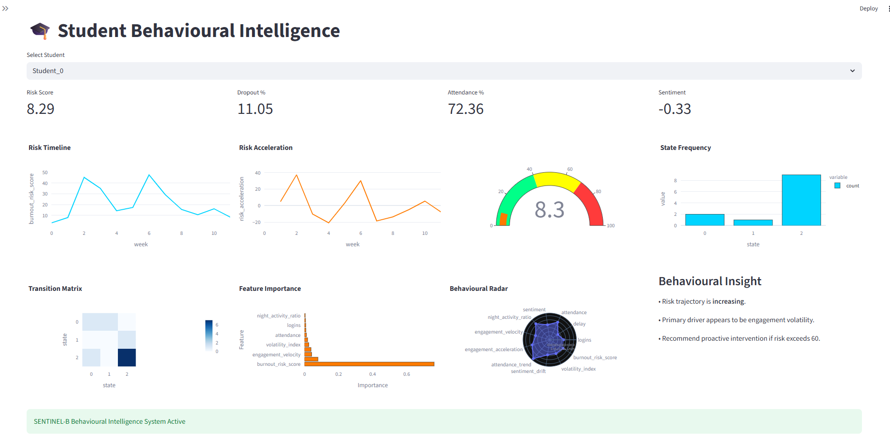
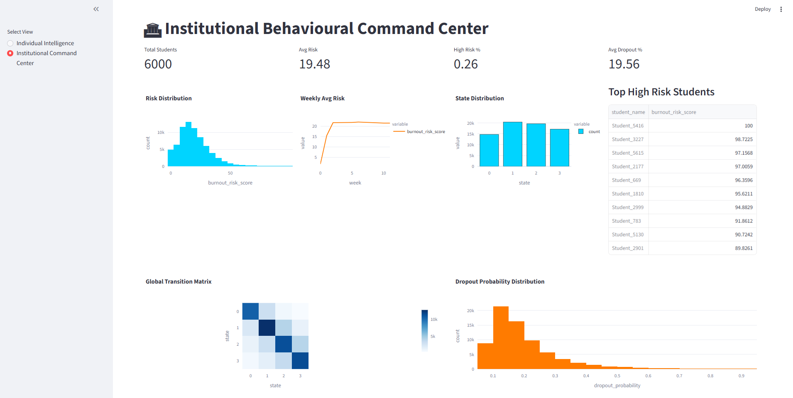

# SENTINEL-B  
## Behavioural Early Warning Intelligence System

SENTINEL-B is a behavioural analytics platform designed to detect early signs of student burnout and dropout risk using temporal behavioural modelling and predictive machine learning.

---

## 🎯 Problem Addressed

Universities typically detect academic risk only after performance drops.  
This system identifies **early behavioural signals** such as:

- Reduced LMS engagement
- Submission delay escalation
- Attendance decline
- Sentiment drift
- Behavioural volatility

---

## 🧠 Methodology

1. Synthetic behavioural data simulation (6000 students × 12 weeks)
2. State-based behavioural transition modelling
3. Temporal feature engineering (velocity, acceleration, drift)
4. Risk scoring framework (0–100)
5. Multi-model ML comparison
6. Stratified 5-fold cross-validation
7. Institutional clustering analysis

---

## 🤖 Models Evaluated

- Random Forest
- Gradient Boosting
- Logistic Regression

Best model selected based on ROC-AUC.

---

## 📊 Evaluation Metrics

- Accuracy
- Precision
- Recall
- F1 Score
- ROC-AUC
- Brier Score
- Cross-validation mean & std
- Confusion Matrix
- ROC Curve

---

## 🖥 Dashboard Capabilities

### 🎓 Individual Intelligence
- Risk Timeline
- Risk Acceleration
- Behavioural Radar Profile
- Transition Matrix
- Feature Importance
- Early Warning Alerts

### 🏛 Institutional Command Center
- Risk Distribution
- Weekly Risk Trends
- High-Risk Ranking
- Global Transition Matrix
- Dropout Probability Analysis

---

## 🚀 How to Run

### 1️⃣ Generate Dataset

### 2️⃣ Train Model

### 3️⃣ Launch Dashboard
---

## 📌 Key Insight

Engagement volatility and attendance drift emerge as dominant behavioural predictors of burnout escalation.

---

## 📸 Dashboard Preview

